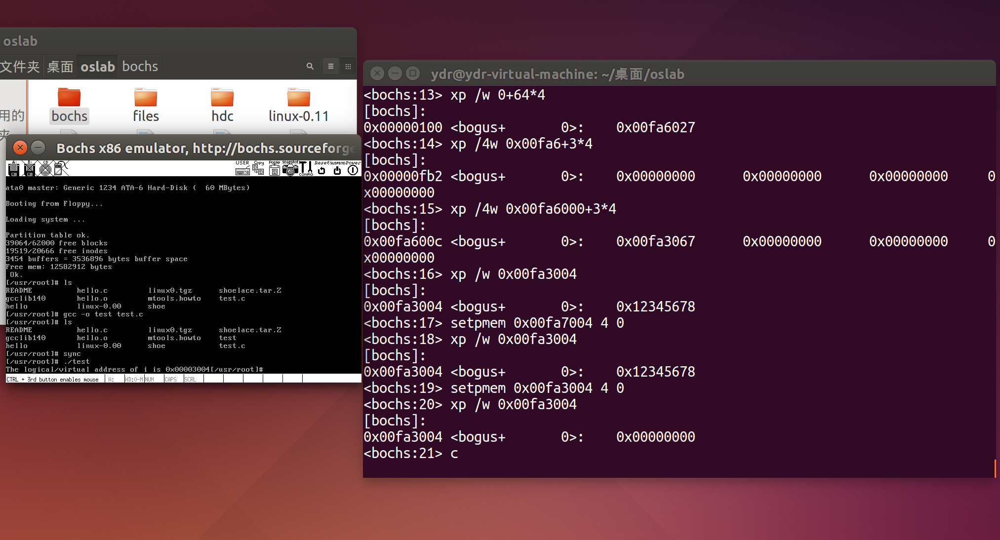
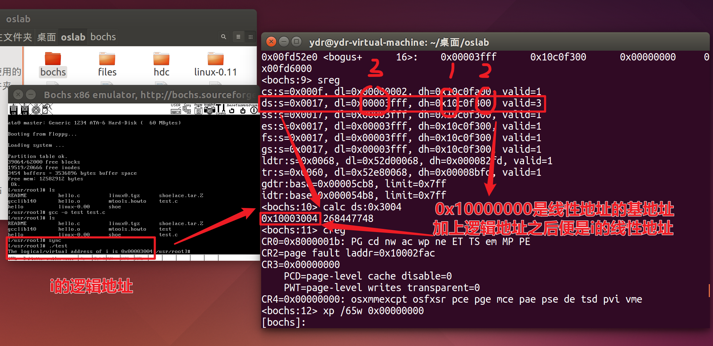
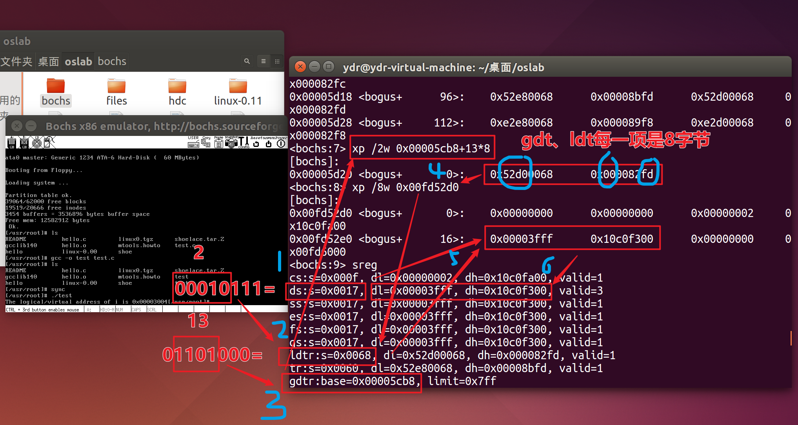
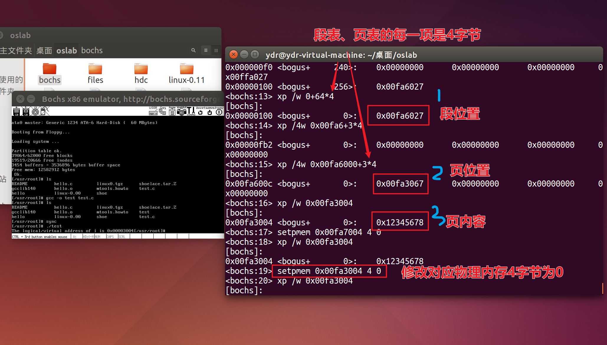
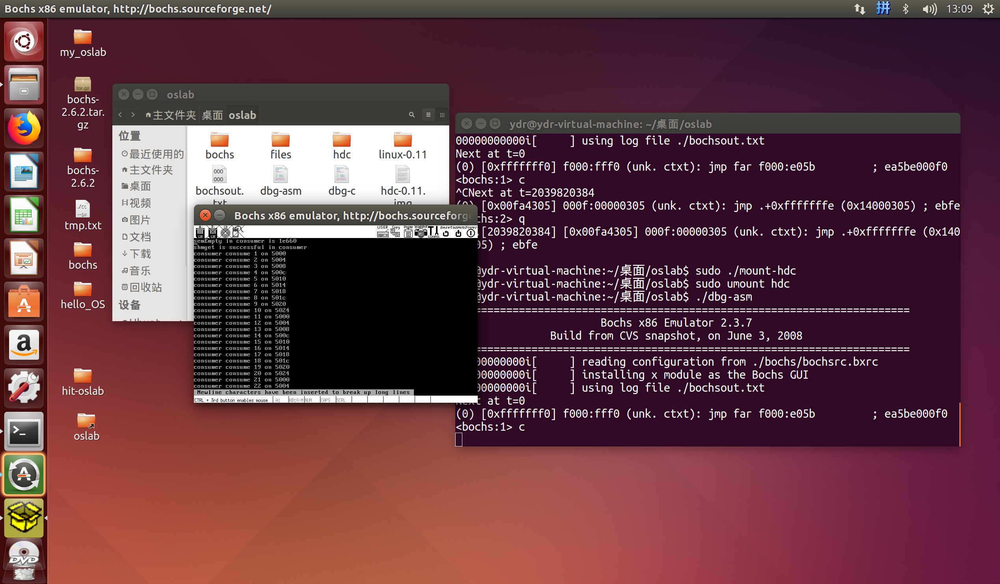
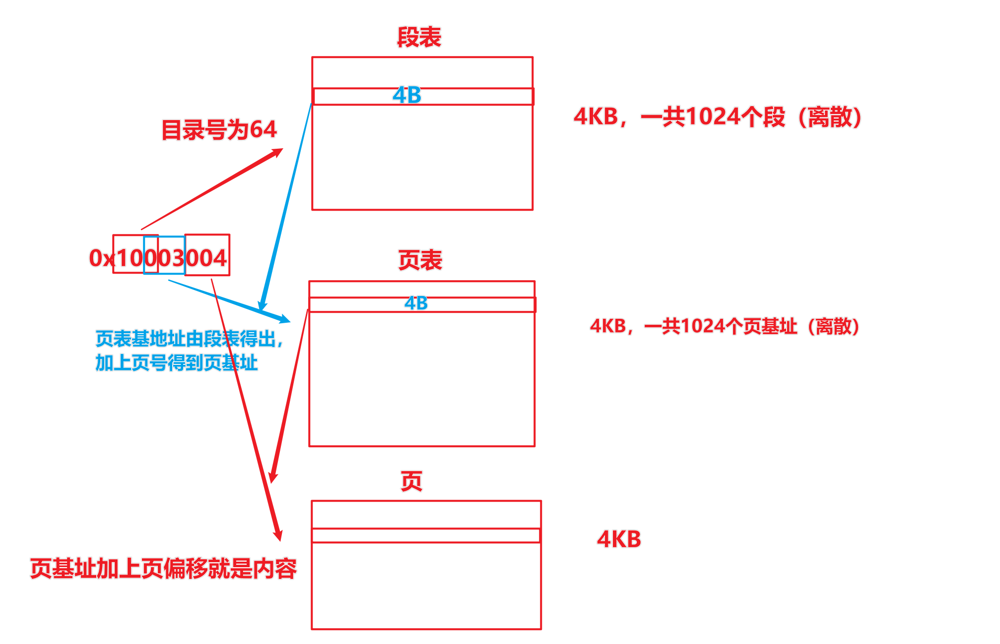

## Linux-0.11源码 ##
用于修改内核代码，熟悉操作系统，但是由于版本较老，高版本Ubuntu下载不了对应的gcc编译器，也或许有着其他不兼容问题，所以要么创建一个低版本Ubuntu虚拟机，要么就还是使用远程机操作https://www.lanqiao.cn/courses/115/learning/?id=570&compatibility=true。

### 关于信号量的实现与应用 ###
# 步骤
1.添加4个系统调用-->system_call.s,unistd.h,sys.h,semaphore.h,sem.c,Makefile
2.编写应用程序pc.c
3.在远程实验机中，由于linux-0.11是从/usr/include文件夹中的头文件编译.c文件，所以还需要将unistd.h、semaphore.h覆盖到该文件夹中才可以正确编译。
### 地址映射与共享
#### 通过bochs调试，在物理内存中将无限循环程序中的判断依据i的值修改0，从而是程序退出

成功将i对应的物理内存的内容修改为了0，循环程序test.c退出。

（似乎前提是下一个语句用上了i）这是得到i的线性地址的过程，实际上应该是通过ds知道了要去ldt找，然后通过ldtr知道了ldt要去gdt找，在gdt找到ldt后（ldtr中存储着对应的ldt应该在gdt的哪个位置），就根据ds去ldt找。如下图

第二张图中的cr3就是段表的基地址0x00000000
而0x10003004的规则是前10为是段号64，中间10位是页号3，最后12位是页内偏移4，如下图便可查找到数据存放的物理位置

#### make并运行producer.c、consumer.c
需要将unistd.h、sys/shm.h、semaphore.h复制到挂载的硬盘上
还需要注意的是不要在代码的旁边注释，似乎linux-0.11中的gcc不能正确识别
#### 运行结果

可以看到的是结果都一样，所以从系统调用传回来的地址是物理地址还是逻辑地址呢
AI的解释是打印出来的是逻辑（虚拟）地址，同时如果允许的话，操作系统会刻意将共享内存的地址映射到相同的虚拟地
#### 理解图
